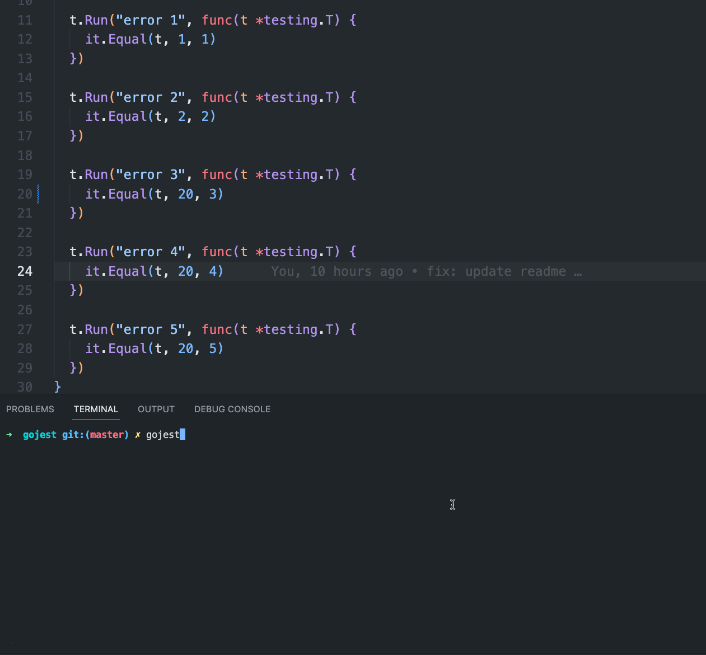

# gojest

gojest is like jest(nodejs) in golang.

[[](https://github.com/ymzuiku/gojest) [](https://pkg.go.dev/github.com/ymzuiku/gojest)]

This git is retest first fail on keydown `f`:



## install

```sh
$ go install github.com/ymzuiku/gojest@latest
```

## use

In your project run:

```sh
gojest
```

And when your keydown:

- a: Test all
- f: Focus test first fail
- c: Test all and not use cache
- q: Quit

## other

[If you need log red path](./README_it.md)
