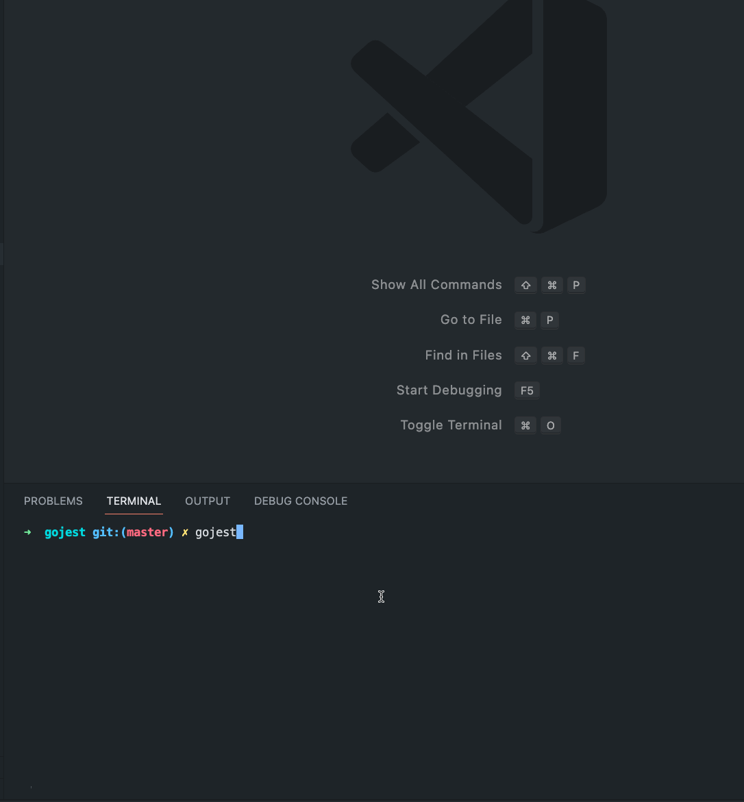

# gojest

二话不说，先上图：



图中我们看到，当你启动 gojest 命令后，可以进行交互式的测试。

1. 按 f 键聚焦第一个失败的用例
2. 当你保持时，可以自动重测
3. 精简了测试信息

有了这个测试库，我们就可以在茫茫多的测试日志中快速定位需要聚焦失败的用例。

## 安装

```sh
$ go install github.com/ymzuiku/gojest@latest
```

## 使用

**在你的项目中**

测试所有:

```sh
gojest ./...
```

测试某个目录下的所有:

```sh
gojest ./dir/...
```

测试所有，并且监听修改事件

```sh
gojest ./... -w
```

在命令行中键入以下按键，切换测试行为:

- 测试所有: `a`
- 聚焦第一个失败的用例: `f`
- 测试所有，且忽视缓存: `shift+a`
- 聚焦第一个失败的用例，且忽视缓存: `shift+f`
- 帮助: `h`
- 退出: `q`

话说回来，这不就是 jest 么？【手动狗头】

最后附上仓库地址：https://github.com/ymzuiku/gojest
